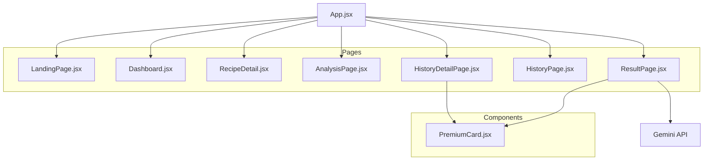

# Graphify Knowledge Graph Report

This report provides a high-level overview of the **cookcookcook** (NutriPick) project structure and dependencies.

## Project Summary
- **Type**: React (Vite)
- **Primary Tech**: React 19, React Router 7, Gemini API (@google/generative-ai)
- **Goal**: NutriPick - Intelligent nutrition platform for meal planning and health tracking.

## Knowledge Graph (Mermaid)

## Component Relationships
- **App.jsx**: The central router and state manager. It tracks `userStats` (calories, nutrition) and routes to all major pages.
- **ResultPage.jsx**: The "brain" of the app. It handles AI-driven food analysis using the Gemini API and fetches images from Unsplash/Wikimedia. It uses `PremiumCard` for chef tips.
- **HistoryDetailPage.jsx**: Displays saved analysis results from `localStorage`. Also uses `PremiumCard` for tips.
- **Dashboard.jsx**: Displays current health metrics, 오늘의 식단 히스토리 (today's meal history), and AI recommendations.
- **AnalysisPage.jsx**: Entry point for food recognition (camera or text input).
- **PremiumCard.jsx**: A reusable, premium-styled UI component used for highlighting "Secret Tips" and other important information.

## Observations
- **State Management**: Centralized in `App.jsx` for real-time stats, while persistent history is stored in `localStorage` (`foodHistory`).
- **External APIs**: Integrated with Google Gemini for analysis and Unsplash/Wikimedia/Wikipedia for food imagery.
- **Localization**: Multi-language support (KO, EN, JA, ZH) implemented via local translation objects in pages.
- **Routing**: Uses React Router 7 for navigation.

---
*Report updated by Antigravity (Graphify Skill) - 2026-05-14*
